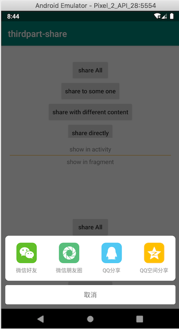

# thirdparty-share



如今的App十个有九个会集成定向分享的功能，当提到分享你可能第一直觉就是ShareSDK，可能很多人都不愿意自己一个一个去接各个第三方分享，因为每个第三方分享的对接方式都不一样，主要包括：

1. 入参不一样；
2. 返回参数不一样；
3. 唤起分享方式不一样；
4. 最重要的是回调方式不一样；

因为它们的千差万别，每接入一个分享还要兼容现有的，想想就头大，因此遇到很赶的项目很少人沉下心来去了解它们，所以ShareSDK就是首选，曾经我也是曾经一员，但一次特别的经历后我退出了，随后iOS团队也遇到一次另外的经历也随后退出了，从此走上自己写分享SDK的路，我所谓的经历就是遇到了通过ShareSDK微信分享失败但没有任何反馈，通过单独接微信分享却是可以的。
其实，ShareSDK并没有做多少工作，无非就是做了一个资源整合的工作，自己实现也能锻炼自己的设计能力，再者遇到问题无需等待第三方解决。总之，如果是一个长期开发维护的项目，自己的项目自己做主，尽可能减少第三方的过度依赖有利于项目良性发展。

## 自己设计分享SDK，要满足以下几个主要功能：
1. 支持文本、网页、图片、视频、小程序等内容分享；
2. 支持QQ好友、QQ空间、微信好友、微信朋友圈、新浪微博等分享平台；
3. 支持一次弹出的分享框里分享出去的内容不一样，如：通过微信好友分享出去的是小程序，通过QQ分享出去的是网页。
4. 支持直接唤起某一个第三方分享；
5. 权限管理(遇到超大的byte[]图片通过Intent传递会导致分享失败，只能先存储，再以存储的图片路径分享出去)；
6. 支持统一的分享回调结果；
7. 统一的管理第三方分享SDK的app id；
8. 最重要的是可灵活增加分享内容类型和分享平台；

## 第三方AppId的统一注册
```java
public class App extends Application {

    @Override
    public void onCreate() {
        super.onCreate();
        ShareConfig.setWetChatAppId("wx3909318230292e7d");
        ShareConfig.setQQAppId("1104718080");
    }
}
```
>建议在Application中注册，这样不会出现运行过程中丢失情况；

## 分享内部的组成部分：
1. ShareTo：即分享平台，支持的分享目标，包括QQ、QZone、Sms、Timeline、WeChat等，ShareTo的子类主要作用是实现抽象方法用于提供分享弹框里的图标和文字、在分享框里的排序、判断分享目标app是否安装、提供appId以及告知支持哪些内容的分享.
2. ShareContent：即分享出去的内容类型，包括AudioUrl、ImageBytes、ImagePath、ImageUrl、MiniProgram、Text、WebUrl、VideoPath、VideoUrl、WebUrl等，ShareContent的子类主要作用是提供构造其必要参数的入口、内部参数校验以及各个平台的具体分享实现
3. SDK的API入口：Share

```java
// 弹出分享框并显示指定shareContent所支持的所有分享图标
WebUrl webUrl = new WebUrl("https://www.qq.com", "百度首页");
Share.with(Activity.this|Fragment.this).shareAll(webUrl);

// 弹出分享框并显示指定数量的ShareTo对应的分享图标
MiniProgram miniProgram = new MiniProgram("https://m.chebada.com", userName, path, thumbnail));
miniProgram.setTitle(resBody.grabShareItem.shareDescription);
miniProgram.setSummary(context.getString(R.string.train_detail_share_des));
WeChat weChat = new WeChat(miniProgram);

QQ qq = new QQ(webUrl);
Share.with(Activity.this|Fragment.this).share(weChat, qq);

// 类似share(ShareTo... shareTos)
Share.with(Activity.this|Fragment.this).share(List<ShareTo> shareTos);

// 直接唤醒第三方分享（无分享框显示）
WeChat weChat = new WeChat(webUrl);
webChat.share(context);

// 统一的分享回调listener
WebUrl webUrl = new WebUrl("https://www.baidu.com", "百度首页");
WeChat weChat = new WeChat(webUrl);
QQ qq = new QQ(webUrl);

Share.with(MainActivity.this).setShareListener(new OnShareListener() {
    @Override
    public void onStart(ShareTo shareTo) {
        super.onStart(shareTo);
        Log.d(TAG, "onStart");
    }

    @Override
    public void onSuccess(ShareTo shareTo, Map<String, String> resultInfo) {
        super.onSuccess(shareTo, resultInfo);
    }

    @Override
    public void onFailed(ShareTo shareTo) {
        super.onFailed(shareTo);
    }

    @Override
    public void onCanceled(ShareTo shareTo) {
        super.onCanceled(shareTo);
    }
}).share(weChat, qq);
```
>将类似微信那种跨越Activity接收回调的方式容纳在内，使得更容易写业务代码
